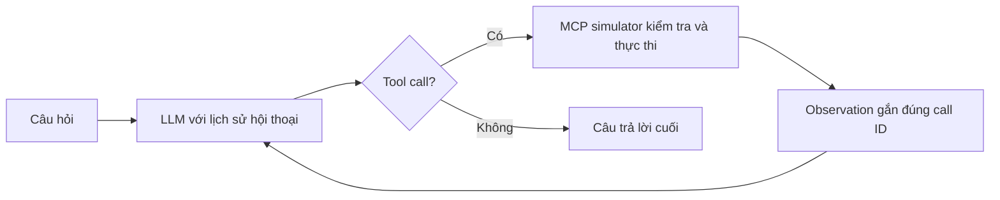

# K4A · Day 03 · Chatbot vs ReAct Agent

**Học viên:** Phạm Minh Cương · **Mã học viên:** 2A202602825 · **Lớp:** Sáng K4A<br>
**Đề tài:** Trợ lý học vụ: tra cứu hồ sơ và đặt lịch tư vấn mô phỏng.

Fork từ [starter K4A](https://github.com/VinUni-AI20k/K4A-Day03-Lab-Chatbot-vs-ReAct-Agent-MCP).<br>
Repo cá nhân: [mcnb2005/K4A-DAY03-PhamMinhCuong-2A202602825](https://github.com/mcnb2005/K4A-DAY03-PhamMinhCuong-2A202602825).

## Chạy trên Windows PowerShell

Yêu cầu Python 3.10–3.12. Trên máy làm bài hiện tại đã tạo `.venv` bằng Python 3.12.14.
Nếu clone sang máy khác, tạo môi trường một lần:

```powershell
python -m venv .venv
.\.venv\Scripts\python.exe -m pip install -r requirements.txt
Copy-Item .env.example .env
```

Không cần kích hoạt môi trường hay đổi ExecutionPolicy; gọi trực tiếp Python trong `.venv`.
Có thể thay `requirements.txt` bằng `requirements-lock.txt` để dùng đúng phiên bản đã kiểm thử.
Chỉ copy `.env.example` khi chưa có `.env`, tránh ghi đè cấu hình đã điền.

Chạy debug miễn phí và so sánh Chatbot:

```powershell
.\.venv\Scripts\python.exe src/app.py --all --provider mock --compare
.\.venv\Scripts\python.exe -m unittest discover -s tests -v
```

Nghiệm thu bằng LLM thật: chỉnh `.env`, đặt `LLM_PROVIDER=gemini` và điền `GEMINI_API_KEY`,
hoặc `LLM_PROVIDER=openai` và điền `OPENAI_API_KEY`. Để `LLM_MODEL` trống dùng mặc định
Gemini `gemini-2.5-flash` / OpenAI `gpt-4o-mini`; có thể chọn model tài khoản hỗ trợ.

```powershell
.\.venv\Scripts\python.exe src/app.py --all --require-live --compare
.\.venv\Scripts\python.exe src/report.py
```

Nếu API lỗi, chương trình ghi lỗi và trả exit code khác 0; **không tự chuyển sang mock**.
`--require-live` từ chối mock. Khóa API chỉ nằm trong `.env` đã được Git bỏ qua.

Trò chuyện hoặc kiểm tra một yêu cầu:

```powershell
.\.venv\Scripts\python.exe src/app.py --interactive
.\.venv\Scripts\python.exe src/app.py --query 'Tra cứu hồ sơ của SV2026002 rồi đặt lịch với cố vấn đó vào 09:30 ngày 16/09/2026.'
.\.venv\Scripts\python.exe src/mcp_server.py
```

Trên macOS/Linux thay `.\.venv\Scripts\python.exe` bằng `.venv/bin/python`.

## Sản phẩm và bằng chứng

| File | Nội dung |
| --- | --- |
| `src/app.py` | ReAct loop tối đa 5 lượt LLM, baseline, kiểm thử và đo trace |
| `src/providers.py` | OpenAI Responses API, Gemini Native Function Calling, mock riêng |
| `src/tools.py` | Hai JSON Schemas, validation và dữ liệu/đặt lịch mô phỏng |
| `src/mcp_server.py` | MCP simulator trong tiến trình, JSON-RPC request/response có ID |
| `config/test_cases.json` | 5 ca nghiệm thu với điều kiện kiểm tra cụ thể |
| `docs/trace_waterfall.json` | Bằng chứng API thật, sinh sau lệnh nghiệm thu |
| `docs/trace_waterfall.eval.json` | PASS/FAIL từng ca với lý do lỗi |
| `docs/trace_waterfall.baseline.json` | Kết quả Chatbot không gọi tool trên cùng 5 câu hỏi |
| `docs/trace_eval.md` | Báo cáo cá nhân, Agentic Fit, kết quả và trích đoạn log |
| `docs/trace_waterfall.mock*.json` | Bằng chứng debug offline, không thay thế API thật |
| `tests/test_agent.py` | Kiểm tra vòng lặp, lỗi, schema, giao thức native và UTF-8 |

Phiên `--interactive`/`--query` ghi `docs/trace_session*.json`, giữ nguyên trace nghiệm thu.
`docs/starter_trace.example.json` là log mẫu có sẵn từ starter, không phải kết quả bài làm.
Mỗi câu hỏi interactive là một tác vụ độc lập; sổ lịch mô phỏng được giữ trong phiên.

## Điểm khác biệt Chatbot và Agent trong bài



TC04 bắt buộc hai hành động phụ thuộc nhau: tra `SV2026002`, nhận cố vấn **TS. Lê Thị B**,
rồi đặt lịch với cố vấn đó ở lượt LLM kế tiếp. TC05 kiểm tra nhánh `NOT_FOUND` và không đặt lịch.
Baseline chỉ sinh text, nói rõ không truy cập được hồ sơ hay thực hiện đặt lịch.

`thought` trong log là **tóm tắt quyết định quan sát được do ứng dụng tạo**,
đánh dấu `thought_source=application_summary`; không phải suy luận nội bộ của mô hình.
Trace đo riêng thời gian LLM và công cụ bằng đồng hồ monotonic; không gán latency mẫu.
Xem [cách đọc trace](docs/TRACE_FORMAT.md) và [checklist gốc](docs/CODELAB.md).

## Phạm vi mô phỏng

LLM có thể là API thật nhưng hồ sơ và lịch hẹn vẫn là dữ liệu thử nghiệm từ starter.
Đây là MCP simulator trong cùng tiến trình, chưa phải MCP SDK server triển khai đầy đủ
qua stdio/HTTP. Sổ lịch nằm trong RAM, được khởi tạo lại khi chạy mới; đặt lại cùng nội dung
trong một phiên trả cùng booking ID. Không có đồng bộ lịch thật, xác thực sinh viên hay quy chế
VinUni chính thức. Phần `src/ai_levels/` là mã tham khảo nguyên bản.

Kiểm thử tự động xác minh công cụ, tham số, thứ tự lượt, trạng thái và vài đoạn thông tin
trong câu trả lời. Cần đọc lại câu trả lời trong log để đánh giá chất lượng ngôn ngữ và đầy đủ ý.

## Nộp bài

Sau khi `--require-live` đạt 5/5 và báo cáo có trích đoạn API thật, commit/push mã nguồn,
`config/test_cases.json`, trace và báo cáo lên repo cá nhân. Dán link repo vào LMS VLearn.
Không đánh dấu đã nộp LMS trước khi thực hiện bước này.

Tài liệu API đối chiếu: [OpenAI Function calling](https://developers.openai.com/api/docs/guides/function-calling),
[Gemini Thought signatures](https://ai.google.dev/gemini-api/docs/generate-content/thought-signatures).
